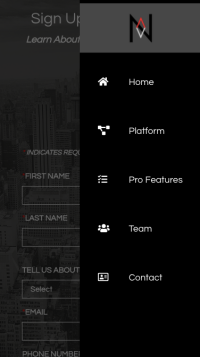
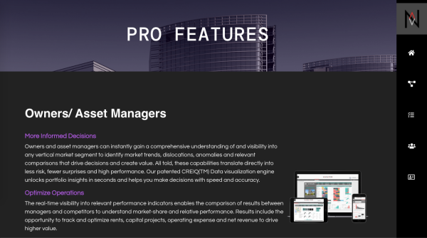

# NavigatorCRE Code Challenge
## **[Live App](https://navcre-code-challenge.netlify.app/)**

## The Code Challenge Prompt
Revamp/redesign the Navigator website with a clear theme and value proposition that meets accessibility standards and is mobile/desktop responsive displaying useful UI/UX trends

Requirements:

- 1 home page, minimum 4 additional pages
- Menu
- 3 features (minimum) your choic
    - Ex. Floating action button, hamburger menu, animated elements (sliding up, hover, etc), words à icons (vice versa)
- Contact/inquiry for

- - - -
## App info
* Built with ReactJS and create-react-app(CRA)
* Sass was used for writing CSS
- - - -
## How to run the app 
1. git clone repo
2. npm install
3. npm start

Dependencies:  React: ^17.0.1
- - - -
## Codes
### Components and Containers   
The app components are organized into common components and container components. Some example of the common components are header, dropdown, and demo form. Specific components cuch as profile for team page are located under team directory. Container components are each of the pages, header, footer, and nav.
### Routes    
The app has five pages '/home,' '/platform,' '/profeatures,' '/team,' and '/contact.' Each route is connected to according component with react-router-dom. 
### State  
React Redux and React Hook(useState) were used for the state to be accessed throughout. 
- - - -
## UI/UX designs
### Content and Images
This mock web site is based on official NavigatorCRE website, where most of the images and all of the contents originate from. Background images were free images from other platforms. 

### Mobile Responsive Design
* The elements respond to screen width and sizes   
 
 

### UX choices 
* Thin side menu with icons
    * Desktop nav bar is thin side bar with icons
        * Page name appears next to the icon as it opens sideway when mouse enters the bar
        * Nav bar closes when mouse leaves the bar
    * Mobile app has button to open the side nav bar
        * Nav bar closes as menu item has been clicked or outside of nav bar has been clicked
* Page scrolls to the top as it renders ]
### UI choices 
* Since Navigator website is themed with NavigatorSRVS, I tried to theme similarly but distinctively as the prompt required redesign of the original

* Themed header with same background and variation in colors
* Each page has its own colored theme  

### Reviewed on
* Mobile
* Chrome
* Safari
    * webp file may not show on older Safari version
* Firefox 

- - - -